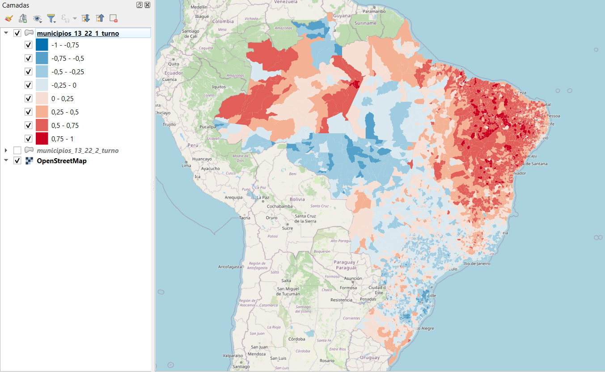
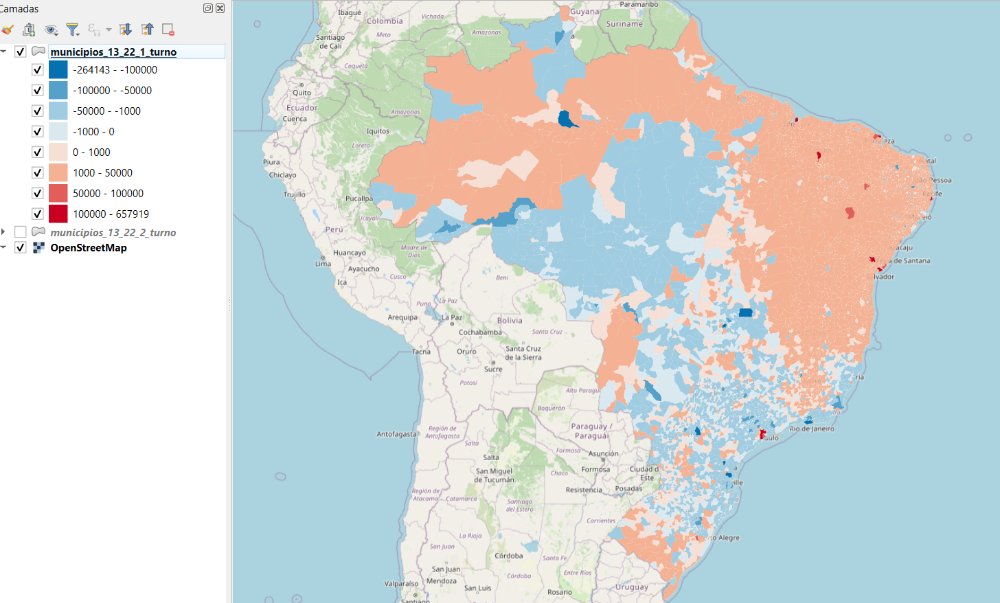
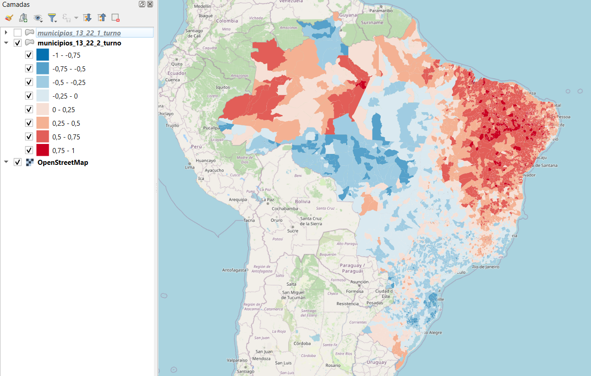

# resultados-presidente-brasil-por-municipio-2022

Resultado eleitoral para presidente do Brasil 1º e 2º turno (2022) agrupados por municipio

Dados obtidos do [TSE](https://dadosabertos.tse.jus.br/en/dataset/resultados-2022/resource/f509562b-3b7f-487d-ad61-145a7ae6b96f) e codigos do TSE por municipio obtidos neste [github](https://github.com/betafcc/Municipios-Brasileiros-TSE)

Pré-visualização dos dados em camada de municípios `.shp` do IBGE:

## 1º turno

### mapa normal 1º turno

### mapa subtração de votos totais 13 - 22 1º turno

## 2º turno

### mapa normal 2º turno

### mapa subtração de votos totais 13 - 22 2º turno

POS_22  NM_MUN	    SIGLA   	porcent_13	        porcent_22	        normal_13_22	        tot_13	tot_22	subt_13_22
1       Curitiba	PR	   	    36.249355787500974	63.75064421249902	-0.27501288424998044	348166	612309	-264143
2       Brasília	DF	   	    41.63863658072056	58.36136341927944	-0.16722726838558885	649534	910397	-260863
3       Manaus	    AM	    	40.87324189677693	59.12675810322307	-0.18253516206446135	430562	622846	-192284

POS_13  NM_MUN	    SIGLA       porcent_13      	porcent_22	        normal_13_22	        tot_13	tot_22	subt_13_22
1       São Paulo	SP          55.58021443214328	44.41978556785672	0.11160428864286559	    3276512	2618593	657919
2       Salvador	BA          73.56802716195025	26.43197283804975	0.4713605432390051	    1022728	367452	655276
3       Fortaleza	CE          60.20315710220384	39.796842897796154	0.20406314204407686	    802009	530162	271847